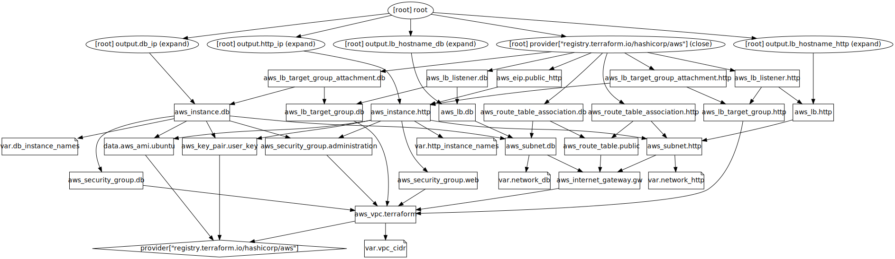

# Flow



### Create stack

```
terraform apply
```

This script will create:
-   1 vpc
-   2 subnet
-   2 instance http
-   3 instance db
-   2 load balancer
-   1 asg


### Install Graph
```
yum install graphviz


### Delete stack

```
terraform destroy
```
